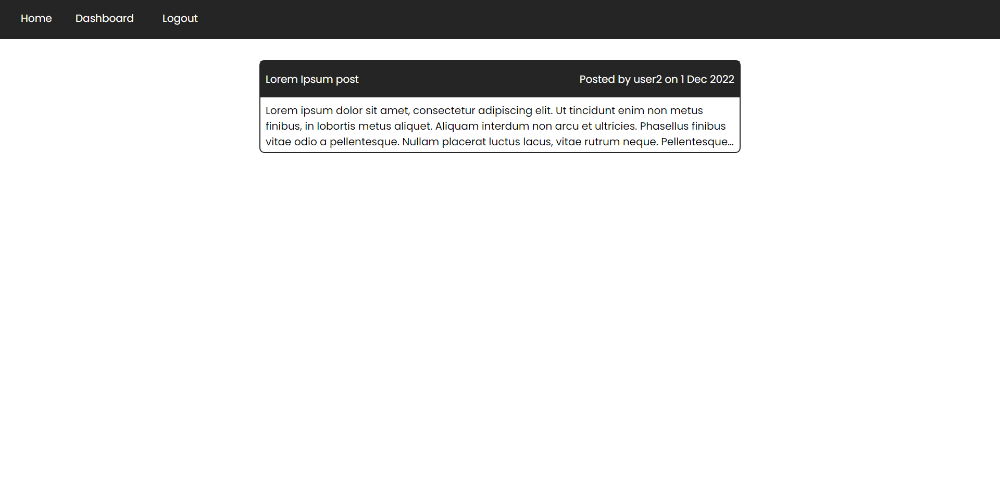

# CMS-Style Tech Blog

## Description

This application is a CMS-style tech blog. Developers may publish blogs posts, see other user's posts, and leave comments. This site follows the MVC-paradigm with a `sequelize` model, `handlebars.js` view, and `express` controller. There are also a variety of different `npm` packages to help give the site functionality.

## Installation

N/A

## Usage

Login or sign up to get started. The application must be downloaded for use. Use `npm i` to install the neccessary packages.

## Contribution

Tiarnan Marsten

## License

